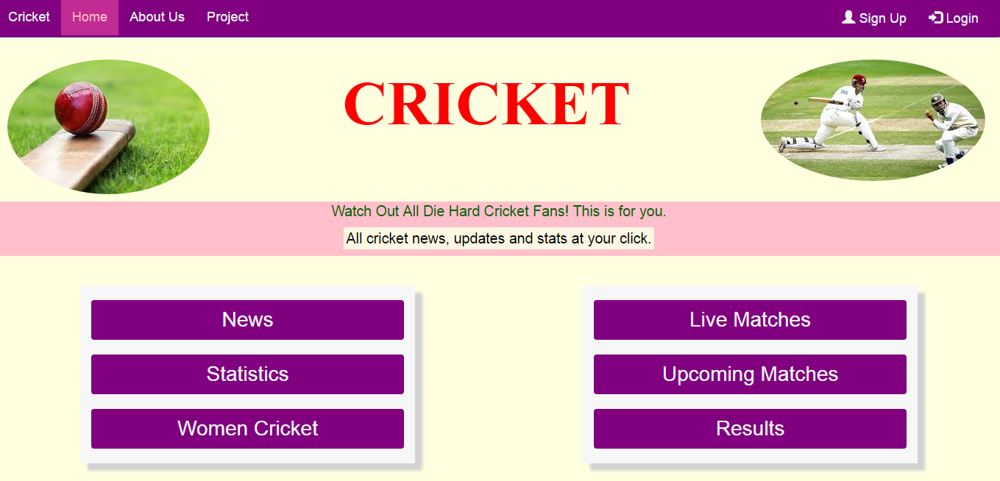
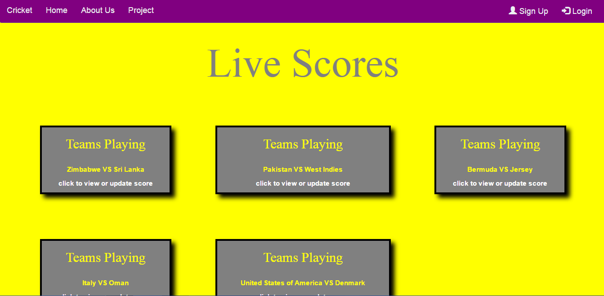
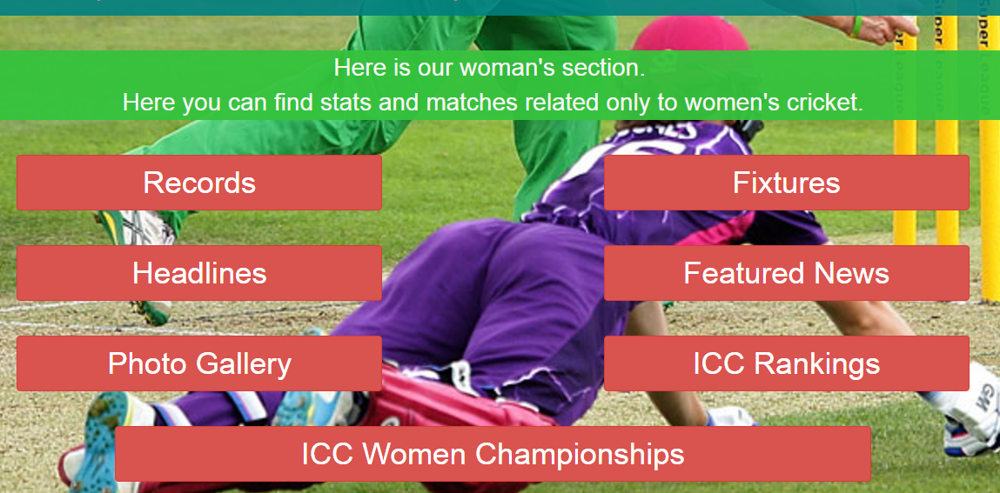
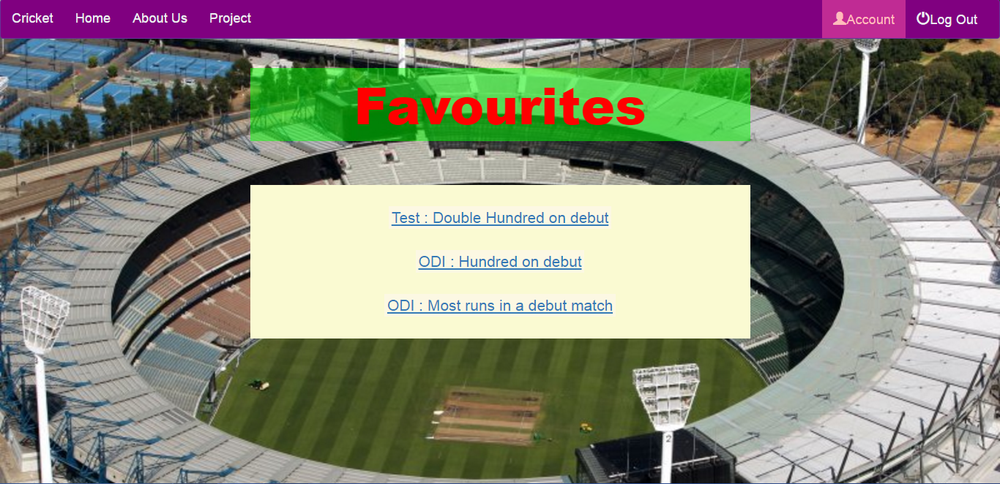

# CRICFRENZY

#### A website that can show records, live scores, results etc of cricket matches built using [Node.js](https://nodejs.org/en/), [MonogoDB](https://www.mongodb.com/) and [Bootstrap](http://getbootstrap.com/). 

## Link : [www.cricket-project.herokuapp.com](www.cricket-project.herokuapp.com)

## Features
* User can see news, interviews, and all past, present results and schedules. You can even view live scores.

* A plethora of records of both men and women cricket are available to users.

 * User can create an account, maintain a small profile and store favourites
 
 
 
 